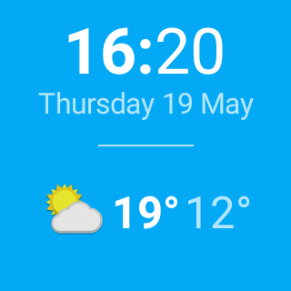
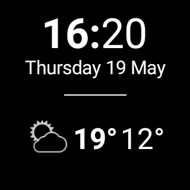
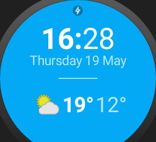
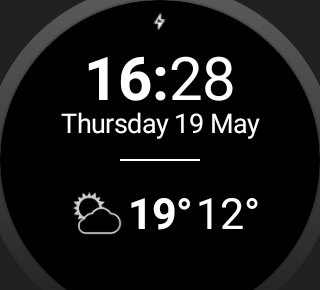
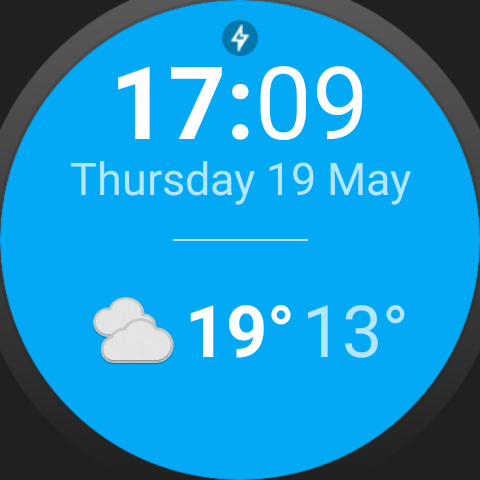
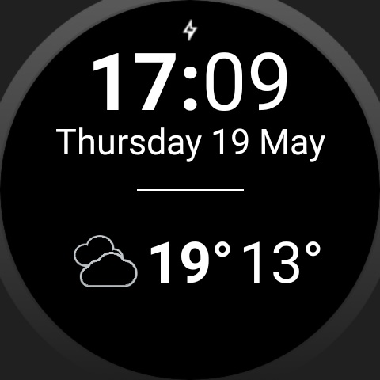

# Go Ubiquitous

This project adds an Android Wear Watchface to the given Weather App ["Sunshine"](https://github.com/udacity/Advanced_Android_Development/tree/7.05_Pretty_Wallpaper_Time) (Udacity Nanodegree Project 6).

Implemented enhancements:

- Digital Watchface displaying time, date, weekday, high-/low-Temperature and a weather indicator icon
- additional update of the wearable via `DataApi` using data items when the app synchronizes the weather data
- storage of received weather data from handheld to `SharedPreferences`
- request for synchronization from wearable to handheld using messages with `CapabilityApi` and `MessageApi`

## Screenshots

## Configuration

Add your personal api key for [http://openweathermap.org/](http://openweathermap.org/appid) to
`local.properties` before building the app.

Please add following line:
`MyOpenWeatherMapApiKey="<MY_PERSONAL_API_KEY>"`